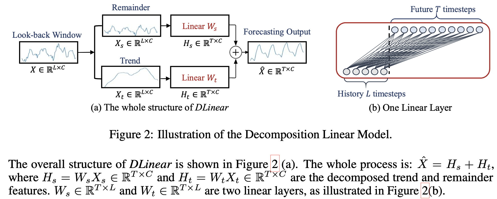

# Time Series Forecasting using DLinear

## DLinear model

It is a combination of a Decomposition scheme used in Autoformer and FEDformer with linear layers. It first decomposes a raw data input into a trend component by a moving average kernel and a remainder (seasonal) component. Then, two one-layer linear layers are applied to each component and we sum up the two features to get the final prediction. By explicitly handling trend, DLinear enhances the performance of a vanilla linear when there is a clear trend in the data.

For DLinear, the moving average kernel size for decomposition is 25, which is the same as Autoformer.
The total parameters of the DLinear are 2TL.
To obtain a smooth weight with a clear pattern in visualization, we initialize the weights of the linear layers in DLinear as 1/L rather than random initialization. That is, we use the same weight for every forecasting time step in the look-back window at the start of training.

## Features

- **An O(1) maximum signal traversing path length**: The shorter the path, the better the dependencies are captured [18], making LTSF-Linear capable of capturing both short-range and long-range temporal relations.
- **High-efficiency**: As LTSF-Linear is a linear model with two linear layers at most, it costs much lower memory and fewer parameters and has a faster inference speed than existing Transformers.
- **Interpretability**: After training, we can visualize weights from the seasonality and trend branches to have some insights on the predicted values.
- **Easy-to-use**: LTSF-Linear can be obtained easily without tuning model hyper-parameters.
