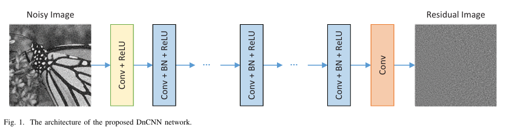
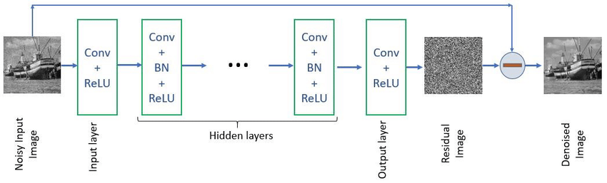
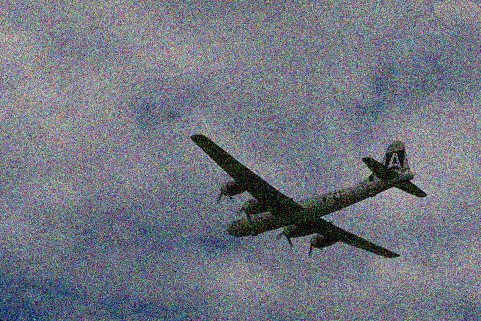
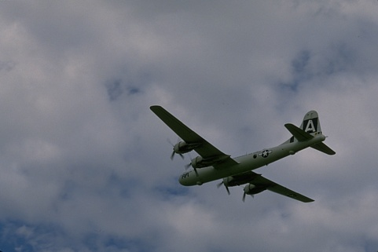
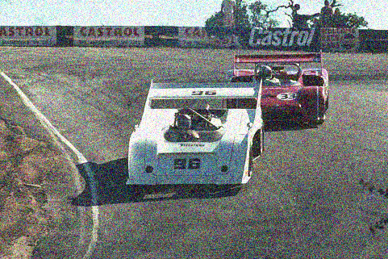
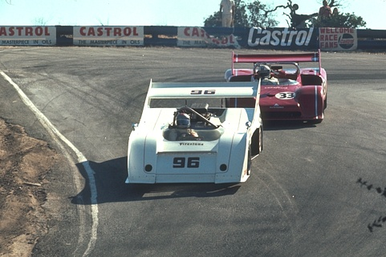

## Model Architecture
Predicting Residual image

Predicting Denoised image (noisy image - residual image)

 Given the DnCNN with depth D, there are three types of layers, shown in Fig. 1 with three different colors.  
 - **Conv+ReLU**: for the first layer, 64 filters of size 3 3 c are used to generate 64 feature maps, and rectified linear units (ReLU, max(0 )) are then utilized for nonlinearity. Here c represents the number of image channels, i.e., c = 1 for gray image and c = 3 for color image. 
 - **Conv+BN+ReLU**: for layers 2 (D 1), 64 filters of size 3 3 64are used, and batch normalization [21] is added between convolution and ReLU.  
 - **Conv**: for the last layer, c filters of size 3 3 64 are used to reconstruct the output.

 To sum up, our DnCNN model has two main features: the residual learning formulation is adopted to learn R(y), and batch normalization is incorporated to speed up training as well as boost the denoising performance. By incorporating convolution with ReLU, DnCNN can gradually separate image structure from the noisy observation through the hidden layers.

We directly pad zeros before convolution to make sure that each feature map of the middle layers has the same size as the input image.

Thus, for Gaussian denoising with  a certain noise level, we set the receptive field size of DnCNN to 35 with the corresponding depth of 17. For other general image denoising tasks, we adopt a larger receptive field and set the depth to be 20.

## Dataset
Github - https://github.com/clausmichele/CBSD68-dataset.git

| Noisy 35 | Original |
|---|---|
||
||
